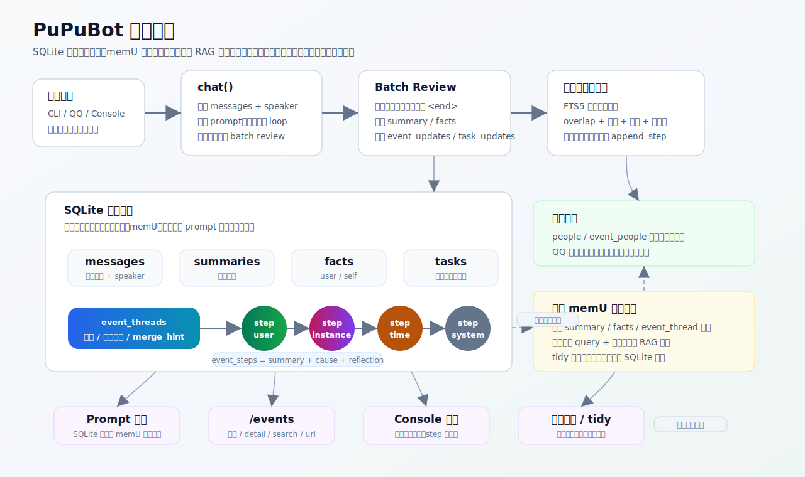
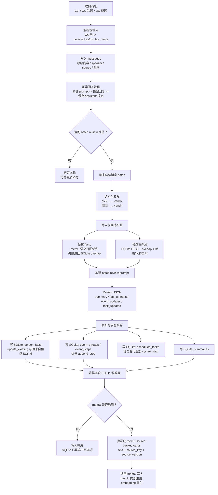
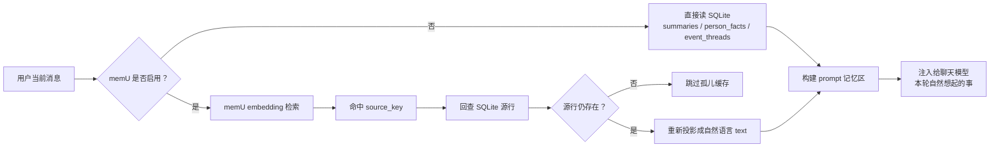
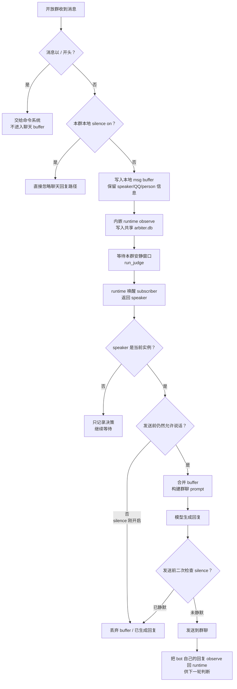

# PuPuBot

PuPuBot 是一个面向长期陪伴聊天的 AI bot 实验项目。它可以运行在命令行、QQ 私聊/群聊和本地 Web 控制台里，核心目标不是只回答当下这一句话，而是维护一段持续关系里的记忆、事件、约定和后续进展。



## 项目亮点

- **长期角色陪伴**：支持角色人设、好感度、按人物归属的长期事实、对话摘要、主动消息和定时跟进。
- **事件链记忆**：用 `event_threads` + `event_steps` 记录持续事件的状态演进。
- **写入前候选召回**：batch review 在写 facts 和 events 前会先看到相关候选，优先更新已有事实或追加已有事件线，减少重复记忆。
- **人物索引**：用 `people` + `event_people` 把事件线和参与人物绑定，私聊、群聊和多实例场景能更稳地区分“谁做了什么”。
- **实例化运行**：每个 bot 都运行在 `instances/<id>` 下，CLI、NapCat 和 Console 共用同一套实例模型。
- **可视化记忆图谱**：`/events url` 可导出自包含 HTML，内置 `events` / `facts` 两种视图，分别查看事件链进展和人物事实关系。
- **SQLite 主库 + memU 语义缓存**：SQLite 保存结构化事实源；memU 只保存由 SQLite 投影出的可删除、可重建 embedding 召回 card。
- **任务与提醒**：支持 scheduled tasks，并把任务取消、错过、重排等变化写回事件线。

## 记忆系统设计

PuPuBot 的记忆系统分成两层：**SQLite 主记忆库**和可选的 **memU 语义召回缓存**。SQLite 始终是唯一事实源；memU 不决定 facts 或 events 是否存在，只保存从 SQLite 投影出来的自然语言 card，用 embedding 做 RAG 召回。你可以把它理解成“结构化主库 + 语义索引缓存”：主库负责真实、可审计、可迁移，缓存负责让模型更容易想起相关内容。

### 主记忆库

长期陪伴对话里的记忆通常不是一次性的：一个约定会被推迟，一个计划会完成，一次互动会变成后续话题。如果每次都创建新的扁平事件，记忆会快速重复、碎片化，也更难稳定召回。因此 PuPuBot 把长期记忆拆成结构化表：

- `people`：固定人物身份，QQ 号会映射到稳定 `person_key` 和显示名。
- `messages`：原始聊天记录，带 `source`、说话人 key、昵称、QQ 号和时间上下文。
- `summaries`：batch review 后写入的批次摘要。
- `person_facts`：稳定长期事实。`subject_person_key` 表示某个人；`object_person_key` 为空时是个人事实，不为空时是两个人之间的关系事实。
- `event_threads`：持续事件线，保存标题、当前状态、生命周期状态、置信度、跟进提示、合并提示、关联任务等。
- `event_steps`：事件线里的进展节点，保存状态变化摘要、触发原因、发生时间和可选反思。
- `event_people`：事件参与人物索引，用于区分群聊、多实例和不同人的事件归属。
- `scheduled_tasks`：提醒和定时任务；任务完成、取消、错过、重排会追加 `system` 类型事件节点。

事件节点有四种类型：

| step_type | 含义 |
| --- | --- |
| `user` | 用户的话或行为推动了事件变化 |
| `instance` | bot 的话或行为推动了事件变化 |
| `time` | 时间自然流逝带来的推测状态，必须保留“可能/推测”语气 |
| `system` | 系统维护、任务取消、错过、重排等导致的状态变化 |

### 写入流程

正常聊天不会每句话都立刻写长期记忆，而是由 batch review 在累计到一定数量的 `chat` 消息后统一整理：

1. 程序先把消息预处理成“人物名：发言 `<end>`”格式，避免模型把 QQ 号、临时昵称和实例名混在一起。
2. 写入 facts 前，`find_related_person_facts()` 会召回本轮相关人物的候选 facts。memU 可用时优先用语义召回；不可用时退回 SQLite/关键词 overlap。
3. 写入 events 前，`find_related_event_threads()` 会从 SQLite FTS5 召回候选事件线，并提供标题、当前状态和最近 steps。
4. review 模型输出 `summary`、`fact_updates`、`event_updates` 和 `task_updates`。`fact_updates` 只允许 `create` 或 `update_existing`；`update_existing` 必须引用本轮候选里的 `fact_id`，不能任意改库。
5. `event_updates` 优先 `append_step` 到已有事件线；只有明显不相关才 `create_thread`。
6. 写入 SQLite 后，如果启用了 memU，再把本轮 `summary` / `person_fact` / `event_thread` 快照写成可召回缓存。memU 写入失败只影响召回，不阻断主库写入。



### memU 语义缓存

SQLite 本体不存 embedding。它保存结构化事实源，并用 SQL、FTS5、唯一索引和手写打分保证可控性。memU 才是 embedding 召回层。

同步到 memU 时，PuPuBot 会把 SQLite 行投影成模型易读的自然语言 card，例如：

```text
小夫 | 外貌: 小夫是光头，没有刘海
```

或：

```text
相关人物: 小夫 / 璐璐; 2026年6月18日晚上亲密约定; 当前状态摘要...; 后续可自然询问...
```

每张 card 还会带源数据指针和版本：

```json
{
  "source_type": "person_fact",
  "source_id": 465,
  "source_key": "person_fact:qq%3A424225912::person:%E5%A4%96%E8%B2%8C",
  "source_version": "hash",
  "projection_kind": "sqlite_source_card"
}
```

`source_key` 用来定位 SQLite 源行；`source_version` 用来判断缓存是否过期。因此 memU 里的 card 可以随时删除并从 SQLite 重建。

### 召回流程

聊天时有两种召回路径：

- 未启用 memU：直接从 SQLite 读取近期 summaries、当前对话人物相关的 `person_facts` 和当前事件线，注入 prompt。
- 启用 memU：用当前消息和最近聊天作为 query，从 memU 召回相关 `summary` / `person_fact` / `event_thread` card，再把它们作为“本轮自然想起的事”注入 prompt。



事件线归并本身不依赖 memU。`find_related_event_threads()` 先用 SQLite FTS5 召回候选，再按关键词 overlap、事件状态、近期活跃度、置信度和人物匹配进行重排。`/events search --debug <query>` 可以看到每条候选的分数组成。

Facts 的写入前候选召回会优先用 memU 的 `person_fact` card 做语义检索，并回 SQLite 读取最新值；memU 不可用时退回本地 overlap 搜索。`/facts search --debug <query>` 可以查看候选 fact 的分数、命中词和是否使用 memU。

### 整理与同步

`/tidy` 现在只负责 memU 缓存一致性，不负责让模型语义归并或删除 SQLite 记忆：

- `/tidy check`：只检查 SQLite 源数据和 memU source cards 是否一致。
- `/tidy` 或 `/tidy apply`：补齐 memU 缺失 card，删除 memU 里的孤儿 card、重复 card，刷新版本过期 card。
- `/tidy rebuild`：清理旧 memU source cache，再按 SQLite 全量重建。

本地维护仍会处理 SQLite 内部的摘要、facts 和事件线轻量更新，但不会 drop 本地事件线。整体原则是：**SQLite 负责真实记忆，memU 负责更容易想起来。**

### 可视化

记忆图谱通过 `/events url` 查看：

- `events` 视图：展示人物、事件线和进展节点，适合检查事件链是否正确归并。
- `facts` 视图：展示人物 facts 和关系 facts，适合检查人物画像与人物关系。

## 开放群对话逻辑

PuPuBot 支持多个实例同时待在同一个开放群里。为了避免两个 bot 抢话，每个实例收到群消息后不会立刻回复，而是先把消息放入本地 buffer，并把观察结果交给控制台进程内的内嵌仲裁 runtime。仲裁 runtime 按群上下文判断本轮应该由哪个 bot 接话；只有被选中的实例才会合并 buffer 内容并生成回复。

开放群的关键状态：

- `msg_buffers["group_<群号>"]`：当前群里已经收到、但还没有生成回复的一批消息。`/silence on` 会清掉这个 buffer，避免开静默后漏出旧回复。
- `arbiter_decision_subscriber`：每个开放群一个后台监听任务，负责等待内嵌仲裁 runtime 返回新的 speaker 决策。
- 群静默：`/silence on` 后会清掉该群待回复 buffer，取消该群 subscriber，并把静默状态写入 `instances/_shared/arbiter.db`；`/silence off` 后恢复仲裁和接话。



`/silence` 的语义是按群生效：

| 命令 | 行为 |
| --- | --- |
| `/silence on` | 本群静默，清空待回复 buffer，取消该群 subscriber，并持久化为 `speaker=none`。 |
| `/silence off` | 关闭本群静默，允许后续群消息继续由内嵌 runtime 仲裁并正常接话。 |
| `/silence` | 查看本群静默状态。 |

静默状态保存在 `instances/_shared/arbiter.db`，重启控制台后仍会继承。

## 钩子层

PuPuBot 提供一个很薄的进程内钩子层，用来观察运行时事件。第一版先开放实例状态钩子，方便后续接入状态面板、外部自动化、本地脚本或调试记录。

```python
from pupu.hooks import register_hook


def on_status(event):
    print(event.name, event.payload)


unregister = register_hook("instance.status", on_status)
```

第一版钩子事件：

| 事件 | 触发时机 |
| --- | --- |
| `instance.status` | 实例 actor 生命周期变化 |
| `chat.started` | 用户发起一轮聊天，输入已进入主链路 |
| `chat.reply_created` | 模型已经生成回复，尚未保存前 |
| `chat.error` | 本轮聊天失败 |
| `memory.review_started` | batch review 确认触发并开始整理 |
| `memory.review_finished` | batch review 成功或失败结束 |

`instance.status` 的 `payload.status` 取值：

| status | 含义 |
| --- | --- |
| `starting` | 实例开始启动 |
| `running` | 实例已完成启动 |
| `stopping` | 实例开始停止 |
| `stopped` | 实例已停止 |
| `failed` | 实例启动失败，`payload.error` 会带错误摘要 |

`chat.*` 事件会带 `context_session`、`identity_session`、`source`、输入或回复预览、图片数量、`should_wait` 和错误摘要等字段。`memory.review_*` 会带整理触发原因、消息范围、摘要长度以及 facts/events/tasks 更新数量。

钩子函数可以是同步函数，也可以是 async 函数；钩子异常只会写入日志，不会阻断实例启动、停止或回复。当前 hook 是**进程内 hook**：如果桌宠 API 挂在 PuPu Console 同一个 Python 进程里，可以直接订阅；如果以后 Tauri 直接启动独立 Python 进程，或实例重新拆成子进程，需要再加 WebSocket/event bus 转发层。

## 快速开始

### 1. 安装依赖

```powershell
python -m venv ForFun
.\ForFun\Scripts\Activate.ps1
pip install -r requirements.txt
```

### 2. 配置

第一次启动时，如果根目录没有 `pupu.yaml`，PuPuBot 会自动从 `pupu.yaml.example` 生成一份。随后编辑 `pupu.yaml` 即可。

最小可用配置通常只需要填写：

- `llm.provider` 以及对应 provider 的 API key，例如 `llm.deepseek.api_key`。
- `user.owner_ids`：如果要使用 QQ owner-only 命令，填你的 QQ 号。
- `instance.qq_mode`：可选 `cli` 或 `napcat`。
- `napcat.port`：使用 NapCat 时填写反向 WebSocket 端口。

API key 不会放进仓库追踪文件。实例相关文件由启动器或 Console 创建在 `instances/<id>/` 下。`pupu.yaml`、`data/`、`instances/`、日志和 SQLite 数据库都已加入 `.gitignore`。

### 3. 创建或选择实例

```powershell
python start.py
```

`start.py` 每次都会要求选择已有实例或创建新实例。项目不再保留根目录默认 bot；每次运行都绑定到一个实例目录，实例拥有自己的 `instance.json`、`persona.json`、`data/pupu.db` 和 `data/memu.db`。

Windows 下可以双击 `启动仆仆.bat`，它只是 `ForFun\Scripts\python.exe start.py` 的启动包装。

如果只想进入 CLI，也可以直接运行：

```powershell
python -m pupu.cli
```

### 4. CLI 命令

常用命令：

| Command | Description |
| --- | --- |
| `/events` | 查看当前事件线 |
| `/events detail <key>` | 查看某条事件线的完整进展 |
| `/events search <query>` | 搜索相关事件线 |
| `/events search --debug <query>` | 查看召回评分细节 |
| `/events url` | 导出独立记忆图谱 HTML，包含 events / facts 两种视图 |
| `/facts` | 查看长期 facts |
| `/facts search <query>` | 搜索相关 facts |
| `/facts search --debug <query>` | 查看 facts 召回评分细节 |
| `/tidy [check|apply|rebuild]` | 检查、同步或重建 memU 语义缓存 |
| `/score` | 查看好感度 |
| `/history` | 查看最近聊天 |
| `/quit` | 退出 CLI |

### 5. 启动 PuPu Console

```powershell
python -m pupu_console
```

打开 [http://127.0.0.1:8770](http://127.0.0.1:8770)。Console 可以创建和管理实例，在同一个控制台进程内启动/停止多个 NapCat actor，导入 SQLite 记忆库，并编辑 soul/persona 预设。记忆图谱请在 CLI 或 QQ 中使用 `/events url` 导出查看。

Windows 下也可以双击 `启动仆仆控制台.bat`。

### 6. 本地桌面客户端接入 API

PuPu Console 提供一组很薄的本地客户端接口，供桌宠、状态面板、语音入口或其它本机 UI 复用现有 agent runtime。客户端只通过 HTTP/WebSocket 和 Console 通信，不需要 import Python 代码，也不直接访问 actor 内部对象。

接口：

| Endpoint | 用途 |
| --- | --- |
| `GET /api/desktop/status` | 读取实例列表、当前可用实例和运行状态 |
| `POST /api/desktop/chat` | 向运行中的实例发送桌面聊天，桌宠会话固定为 `desktop_owner` |
| `WS /ws/desktop/events` | 订阅 `instance.status`、`chat.*` 和 `memory.review_*` hook 事件 |

先启动 Console：

```powershell
python -m pupu_console
```

打开 [http://127.0.0.1:8770](http://127.0.0.1:8770)，创建或启动一个实例后，本地客户端即可调用这些接口。当前接口按本机 Console 使用场景设计，不应直接暴露到公网；如果后续要给非本机客户端使用，需要先补 token、origin 或其它访问控制。

### 7. 启动 QQ Bot

创建或编辑一个 `qq_mode=napcat` 的实例，然后运行 `python start.py` 并选择它。多实例运行推荐使用 PuPu Console 启停。

NapCat 实例使用 `instance.json` 里的 `port`。NapCat 反向 WebSocket 地址配置为 `ws://127.0.0.1:<port>/onebot/v11/ws`，例如 `ws://127.0.0.1:18081/onebot/v11/ws`。

## 项目结构

```text
pupu/                       Core memory, agent, LLM, tools, tasks, event graph
pupu/actor/                 Single-process instance actor and OneBot v11 transport
pupu/storage/               SQLite schema and storage adapters
pupu/memory_index/          Optional memU adapter and tidy sync
pupu_console/               Local web console, instance manager, and group arbiter
docs/                       Extra guides and architecture notes
tests/                      Unit tests
```

## 测试

在仓库根目录运行：

```powershell
python -m unittest discover tests
```

不要直接使用裸的 `unittest discover`，某些工作区里历史临时文件可能会被误收集。

## 安全说明

这个仓库只适合发布源码。不要提交：

- `pupu.yaml`, instance `instance.json` if it contains private account data
- SQLite memory databases
- logs, backups, exported event graph pages
- instance folders and soul presets containing private persona or account data

如果你曾经把 API key 或聊天数据库提交到任何远程，请在公开仓库前轮换相关 key。
